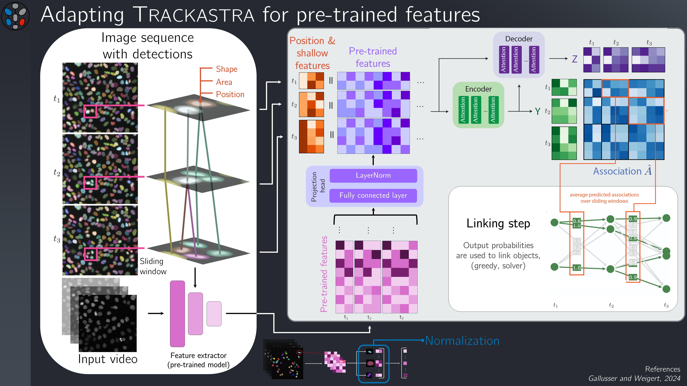

<div align="center">

<p align="center">

</p>


[](https://github.com/weigertlab/trackastra/blob/main/LICENSE)

</div>


# *Trackastra Et Ultra* - Tracking by Association with Transformers and Pretrained Features


*Trackastra et Ultra* (`trackastra_pretrained_feats`) is a Python library that provides a small API to extract pretrained features for use in [Trackastra](https://github.com/weigertlab/trackastra), meant for enhancing cell tracking performance using features from foundation models such as [SAM2.1](https://github.com/facebookresearch/sam2) or [CoTracker3](https://github.com/facebookresearch/co-tracker).

<p align="center">

</p>

Must be installed in order to use the SAM2.1-powered (or other foundation model) pre-trained model(s) in Trackastra.

## Installation

Can be installed as an optional module of Trackastra:

```bash
pip install trackastra[pretrained_feats]
```

For standalone installation (Trackastra still required):

```bash
pip install trackastra
pip install git+https://github.com/C-Achard/Trackastra-et-Ultra.git
```

## Reference

If you use this code, please cite the following publication:

[Trackastra: Transformer-based cell tracking for live-cell microscopy](https://www.ecva.net/papers/eccv_2024/papers_ECCV/papers/09819.pdf)

```
@inproceedings{gallusser2024trackastra,
  title={Trackastra: Transformer-based cell tracking for live-cell microscopy},
  author={Gallusser, Benjamin and Weigert, Martin},
  booktitle={European conference on computer vision},
  pages={467--484},
  year={2024},
  organization={Springer}
}
```

## Training models

To train your own pre-trained features models, please check out the [main repo fork used for training](https://github.com/C-Achard/trackastra/tree/cy/aug-zarr-caching).

Feel free to reach out for help if you'd like to train your own models, as it is still experimental.

## Authors

Made by Cyril Achard, under the supervision of Martin Weigert and with help from Benjamin Gallusser.